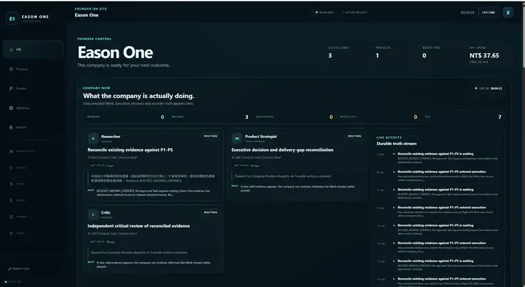
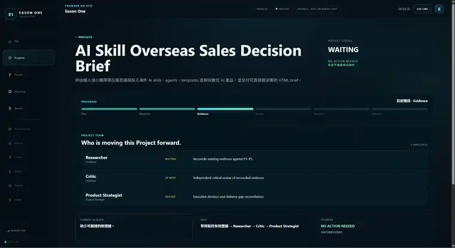
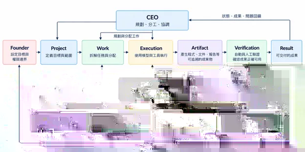

# EASON ONE

### Multi-Agent 虛擬公司作業系統

EASON ONE 是我設計的一套 Multi-Agent 系統。Founder 提出目標與權限邊界，CEO 將目標整理成 Project 與 Work，再由持久化的 AI Employees 使用不同模型與工具執行；只有經過 Artifact 與 Verification 的成果，才會成為可交付的 Result。

> **目前狀態：Active development / Engineering prototype**  
> Company Core：`0.20.0`

## 實際產品畫面

<table>
<tr>
<td width="50%"></td>
<td width="50%"></td>
</tr>
<tr>
<td><b>Headquarters</b> — Founder 看到公司目前的 Project、AI Employees、狀態、活動與成本。</td>
<td><b>Project</b> — 顯示 semantic progress、Project Team、blocker、next step 與 Founder action。</td>
</tr>
</table>

## 30 秒看懂

`Founder → CEO → Project → Work → Execution → Artifact → Verification → Result`

Governance、Budget、Recovery、Memory 不是附加功能，而是包住這條流程的系統約束。

EASON ONE 不是 ERP，也不是「多個 AI 一起聊天」。它探索的是另一個問題：**要怎麼讓會失敗、會花錢、會產生不確定結果的 AI Agent，能像一個長期存在的組織一樣被分工、限制、驗證與恢復。**

## 為什麼做 EASON ONE

我在早期測試中遇過一個很直接的問題：Task 已建立、畫面狀態也持續往前，但實際的模型或工具並沒有真正執行。這讓我開始把「建立工作」、「實際執行」、「產生成果」與「驗證成果」拆成不同階段。

因此 EASON ONE 的核心不是讓 Agent 看起來很忙，而是讓系統能回答：

- 這個工作真的執行了嗎？
- 是哪一位 Employee、哪一次 Execution 做的？
- 產出了哪一版 Artifact？
- 有沒有通過 Verification？
- 失敗或重啟後，系統能不能從 durable truth 正確接續？
- 哪些事情 Agent 可以自己做，哪些事情必須回到 Founder？

## 我希望 EASON ONE 最後變成什麼

我的目標不是做一個能一次回答很多問題的「超級 AI」，也不是追求完全無人監督。我想把 EASON ONE 做成一個**可以長期存在、持續承接真實目標的 AI 組織**。

理想狀態是：

- Founder 主要負責方向、權限邊界與關鍵決策，不必親自把每個目標拆成一連串操作。
- CEO 能依照公司現在的狀態建立 Project、拆分 Work、安排順序與調度人力；能力或容量不足時，走 HR / HiringRequest，而不是硬塞工作。
- AI Employees 有持久的身分、責任、記憶與工作容量，可以跨時間接續同一個組織中的工作，但不能因為模型能力更強就越過權限。
- 系統追求的不是「看起來一直在跑」，而是工作真的執行、產物真的存在、結果真的驗證過；失敗可以恢復，process 重啟後也能從 durable truth 接續。
- 隨著 Project 增加，系統能累積組織記憶、改善分工與後續判斷，而不是每一次都從零開始。

長期來說，我希望 EASON ONE 不只是展示用的專題，而是我未來做產品、研究與經營 Eason Systems 時真的能使用的 operating layer：讓 AI 從一次性的工具，逐步變成**可管理、可追責、能合作的組織成員**。人仍然保留方向與關鍵決策權，但不必親自處理每一個執行細節。

## 系統架構

<p align="center">
  
</p>


### Founder-facing surface

**Headquarters** 顯示公司目前真正正在發生的事：Active Projects、AI Employees、Founder attention、成本與 recent activity。

**Project** 頁面則聚焦單一專案：目前狀態、semantic progress、Project Team、每位 Employee 正在做什麼、blocker、下一步、Founder 是否需要介入，以及預算使用情形。

## 核心工程設計

- **Autonomy ≠ authority**：Agent 可以自主工作，但不能因此取得 Founder 的權限。
- **Proposal ≠ mutation**：模型提出計畫，不等於 durable state 已經被修改。
- **Execution ≠ verified outcome**：模型回覆完成，不等於成果已被接受。
- **Activity ≠ semantic progress**：有事件、有 Work、有 AgentRun，不代表專案真的前進。
- **Employee identity ≠ model/provider**：Employee 是持久化的組織角色，底層模型可以替換。
- **Workforce capacity is governed**：一般 Project execution 中，同一位 Employee 同時間只能服務一個 Active Project；同一 Project 內可以排多個 Work，但會依序執行。
- **Artifact-first verification**：Verification 綁定特定 Artifact Version，不沿用模糊的「review passed」。
- **Durable recovery**：retry、receipt、checkpoint、reconciliation 與 restart 都以資料庫中的 durable truth 為依據。
- **Budget before side effects**：可能產生付費副作用前先 reserve，完成或失敗後再 settle / release。

詳細設計見 [Architecture](docs/ARCHITECTURE.md) 與 [Engineering Notes](docs/ENGINEERING.md)。

## 本機啟動

Windows PowerShell：

```powershell
python -m venv .venv
.\.venv\Scripts\Activate.ps1
python -m pip install -e ".[test]"
flask --app run.py seed
.\scripts\run-headquarters.ps1
```

啟動後開啟：

```text
http://127.0.0.1:5000/headquarters
```

真實 provider 執行需要本機 `.env` 與對應憑證；repository 不包含真實金鑰。

## 驗證

```powershell
python -m compileall -q eason_one scripts tests
python scripts/audit_v020_core.py
python scripts/audit_v020_governance.py

$env:PYTEST_DISABLE_PLUGIN_AUTOLOAD="1"
python -m pytest -q --basetemp=.pytest-eason-one-temp -p no:cacheprovider
```

Repository 的 GitHub Actions 也會在 `main` push / pull request 時執行測試。

## 文件

- [Architecture](docs/ARCHITECTURE.md) — 角色、Project / Work / Execution / Artifact / Verification / Result 的關係。
- [Engineering Notes](docs/ENGINEERING.md) — 真正遇到的工程問題、設計取捨與證據入口。
- [Project Structure](docs/PROJECT_STRUCTURE.md) — source、tests、scripts 與文件閱讀地圖。
- [Demo Guide](docs/DEMO_GUIDE.md) — Founder-facing 展示順序與 demo 邊界。
- [Engineering History](docs/history/README.md) — 歷史 checkpoint、gate failure 與 review 紀錄。

## AI-assisted engineering

本專案採 AI-assisted engineering workflow。我負責產品方向、系統架構、規則設計、測試標準、問題判斷與實際驗證，並使用 Codex、ChatGPT 等工具協助實作、重構與程式審查。AI 產生的修改仍需經過 tests、audit 與實際驗證，才會進入 current system。

## 目前邊界

EASON ONE 目前是 engineering prototype，不宣稱 production ready。SQLite 用於目前的單機工程驗證；真實模型執行仍依賴 provider、網路、憑證與預算授權。部分 recovery / host validation 也只有在相應主機環境中才能完整驗證。
