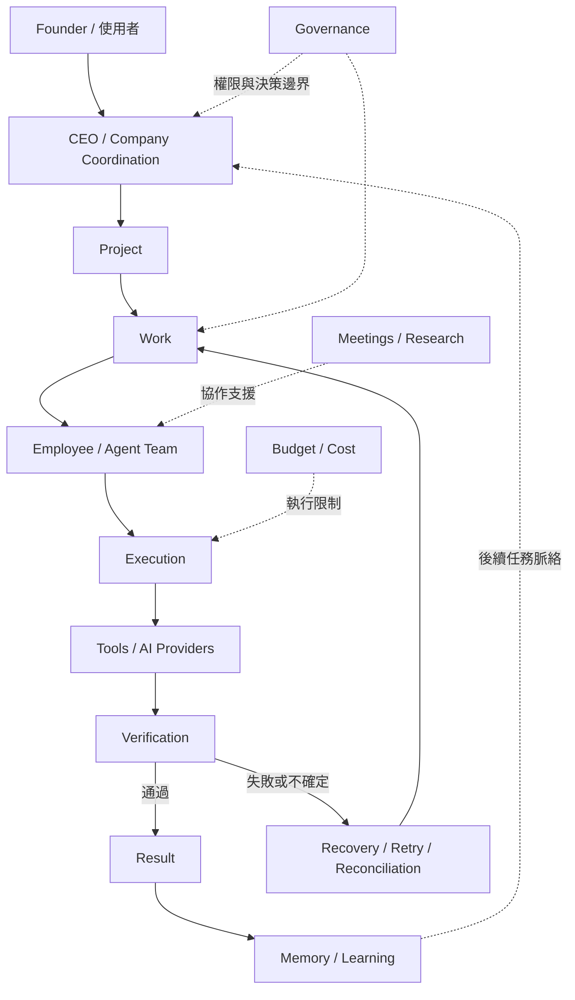

# EASON ONE

### Multi-Agent 虛擬公司作業系統

EASON ONE 是我設計的一套 Multi-Agent 系統，以虛擬公司的方式組織多個 AI Agent，讓使用者交付一個目標後，系統能進行規劃、分工、執行、驗證與回報，而不是只依賴單一 AI 完成整件事情。

> 目前狀態：**Active development / Engineering prototype**。本 repository 的 current worktree 是 S12 系統狀態；底層 Company Core 套件版本為 `0.20.0`。這不代表後續 R12 Engineering Hardening 已完成或通過驗證。

## 30 秒看懂 EASON ONE

使用者扮演 **Founder**，提出目標並保留關鍵決策權；**CEO** 將目標整理為 Project 與可執行的 Work，再交給具不同職責的 AI Employees / Agents。Agent 可透過模型與工具執行，但成果不會只因模型「說完成了」就成立：系統會保存執行證據、驗證產物，並在失敗時進入受限制的重試、恢復或重新協調流程。完成後，Result 回到 Founder，可信的經驗才會進入 Memory / Learning。

`Founder → CEO → Project → Work → Agents → Tools / Providers → Verification → Result → Learning`

它不是 ERP，也不是單一聊天機器人。核心問題是：如何讓多個 AI 在具有角色、權限、責任、預算、工作狀態、驗證與失敗恢復規則的系統內共同完成事情。

## 為什麼做這個

複雜任務交給單一 AI 時，容易遇到 context 過長、單一模型判斷受限、分工不清、執行與驗證混在一起、失敗後難以恢復，以及權限與責任邊界不明。EASON ONE 嘗試把這些問題轉成系統設計問題：讓工作可以拆分、狀態可以追蹤、決策可以追溯、花費可以約束、結果可以驗證。

## 系統怎麼運作



Governance、預算、恢復與記憶不是最後才附加的功能，而是穿過 Project、Work、Execution 與 Result 的約束。詳細互動見 [`docs/ARCHITECTURE.md`](docs/ARCHITECTURE.md)。

## 一個任務的生命週期

1. Founder 交付目標與限制。
2. CEO 整理意圖、規劃工作，必要時要求 Founder 補足關鍵決策。
3. 系統建立 Project contract 與 Work，保存授權、接受條件與預算資訊。
4. 依角色、能力與工作關係選擇 Employee / Agent；Work 可形成相依或平行分支。
5. Agent 在 execution contract 範圍內呼叫模型、研究能力或工程工具。
6. Artifact 與 execution evidence 進入 verification，而不是直接宣告 Project 完成。
7. 失敗或狀態不明時，系統依 durable checkpoint、receipt 與政策進行 bounded retry、recovery 或 reconciliation。
8. 只有超出既有授權、預算或需要人類判斷時，才回到 Founder。
9. 接受條件成立後形成 Project Result，供 Founder 檢視或接受。
10. 有證據支撐的工作經驗才可形成後續 Employee / CEO memory。

目前並非所有情境都能完全自主完成；外部 provider、主機工具、人工決策與部分 recovery path 仍會影響流程。

## 實際處理的工程問題

以下能力都有對應 source 與 tests，而不是只存在於介面文案：

- **Multi-Agent orchestration**：Work graph、team formation、多人執行與 review handoff。
- **Founder / CEO authority boundary**：Founder Project Contract、proposal authority、governance gate 與可追溯 decision。
- **Durable lifecycle**：Project、Work、Execution、Artifact、Verification、Result 的分層狀態與事件紀錄。
- **Idempotency 與 recovery**：execution receipt、checkpoint、lease、retry lineage、restart reconciliation，避免重複外部副作用。
- **Paid execution / budget control**：執行前 reserve、成本快照、硬上限與平行分支預算控制。
- **Provider routing**：OpenAI、Anthropic 等 provider adapter 與 model configuration；是否可用仍取決於本機環境與憑證。
- **Meetings、research、memory / learning**：受治理的會議協作、研究部門、版本化 artifact 與 evidence-backed learning。
- **Verification 與 release audits**：獨立 verification records、acceptance contracts、migration 與核心治理 audit scripts。
- **Long-history read paths**：針對持久化歷史、投影一致性與查詢效能的測試與工程修正。

設計證據與取捨整理在 [`docs/ENGINEERING.md`](docs/ENGINEERING.md)。

## 開發方式

本專案採 **AI-assisted engineering workflow**。我負責產品方向、系統架構、規則設計、測試標準、問題判斷與最終取捨，並使用 Codex / AI coding tools 協助實作、重構與程式審查。AI 產生的修改仍需經過測試、audit 與實際驗證後，才能進入系統。

## Repository 結構

- `eason_one/`：Flask application、資料模型、routes、services、templates 與 static UI。
- `tests/`：從 unit / integration 到 governance、migration、recovery 與 acceptance contract 的測試。
- `scripts/`：啟動、驗證、audit、migration、reconciliation、安裝與 rollback 工具。
- `docs/`：架構、工程決策、版本變更與 acceptance evidence。
- `run.py`、`pyproject.toml`：application entry point 與 Python package / dependency 定義。

較完整的閱讀地圖見 [`docs/PROJECT_STRUCTURE.md`](docs/PROJECT_STRUCTURE.md)。建議閱讀順序：README → Architecture → Engineering → source / tests。

## 本機執行

需求：Python 3.13 或更新版本。Windows PowerShell：

```powershell
python -m venv .venv
.\.venv\Scripts\Activate.ps1
python -m pip install -e ".[test]"
flask --app run.py seed
.\scripts\run-headquarters.ps1
```

也可用 `python run.py` 啟動開發伺服器。預設資料庫位於 `instance/eason_one.db`，不應提交 Git。若要使用付費模型，在本機 `.env` 設定相應環境變數，例如 `OPENAI_API_KEY` 或 `ANTHROPIC_API_KEY`；repository 不包含真實金鑰。

常用驗證：

```powershell
python -m compileall -q eason_one scripts tests
python scripts/audit_v020_core.py
python scripts/audit_v020_governance.py
$env:PYTEST_DISABLE_PLUGIN_AUTOLOAD="1"
python -m pytest -q --basetemp=.pytest-eason-one-temp -p no:cacheprovider
```

## 限制

- 這是持續驗證中的 engineering prototype，不是宣稱 production ready 的 SaaS。
- 實際模型執行依賴外部 provider、有效憑證、網路與當下 provider 行為。
- Autonomous loop 受 Founder authority、governance gate、預算及可用工具限制；部分決策刻意保留給人。
- SQLite 適合目前單機工程驗證，但不是大型多節點部署方案。
- 部分 recovery、host validation 與真實付費執行只能在具備相應環境的主機完成。
- 歷史版本文件保留了演進與 audit 脈絡；current truth 仍以 current source、tests 與最新驗證結果為準。

## 深入閱讀

- [`docs/ARCHITECTURE.md`](docs/ARCHITECTURE.md)：角色、狀態與跨系統能力如何互動。
- [`docs/ENGINEERING.md`](docs/ENGINEERING.md)：真正遇到的工程難題、設計取捨與證據入口。
- [`docs/PROJECT_STRUCTURE.md`](docs/PROJECT_STRUCTURE.md)：source、tests、scripts 與文件導覽。
- [`docs/V0.20-ENGINEERING-CONSTITUTION.md`](docs/V0.20-ENGINEERING-CONSTITUTION.md)：Company Core 的 release-blocking invariants。
