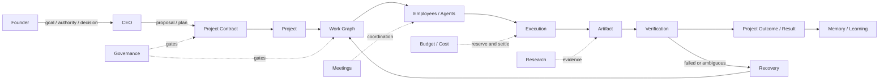

# EASON ONE Architecture

這份文件說明 EASON ONE 的角色與資料如何互動。它不是 class reference；真正的型別、欄位與狀態轉移仍以 `eason_one/models.py`、`eason_one/services/` 與 tests 為準。

## 核心觀念：模型提出內容，系統持有權威狀態

EASON ONE 用「虛擬公司」組織多個 Agent，但不把模型輸出直接當成事實。模型可以提出計畫、研究、產物或 review；Project 是否獲得授權、Work 是否可執行、預算是否足夠、Artifact 是否通過驗證、Project 是否完成，則由持久化資料與 deterministic service rules 判定。

## 角色與責任

### Founder

Founder 是最終的人類權威來源。Founder 提供目標、限制、預算與接受條件，並處理超出既有 authority boundary 的決策。Founder 不需要介入每個執行步驟；系統的目的之一，就是把只需機器處理的進度與真正需要人類決策的 gate 分開。

### CEO

CEO 是協調角色，不是無限制的 superuser。它將 Founder intent 轉成 proposal、Project 與 Work，選擇組織路徑，彙整結果，並在授權範圍內推進。`ceo_intent.py`、`ceo_operating.py`、`ceo_review.py` 與 `proposal_authority.py` 分別承擔理解、運作、審查及授權邊界的一部分。

### Employee / Agent

Employee 是持久化的組織角色；Agent execution 是一次具體執行。角色、職位、manager、instruction version、可用工具與 provider snapshot 會被保存，使結果能追溯到「誰在什麼規則下做了什麼」，而非只有一段無來源文字。`team_formation.py`、`workforce.py`、`multi_agent.py` 與 `work_execution.py` 負責不同階段。

## 工作與結果模型

### Project

Project 是 Founder 目標的治理範圍。Project contract 保存目標、限制、接受條件與 authority；狀態投影不應越過 contract 宣告完成。`project_contract.py` 建立權威邊界，`projects.py` 與 `project_company.py` 提供操作及公司視角。

### Work

Work 是實際可分派、可相依、可驗證的工作單位。Work graph 可以表達順序與平行分支，並把 management、delivery、review 等責任分開。Work 完成只是 Project completion 的必要證據之一，不等於整個 Project 已完成。

### Execution 與 Tools / Providers

Execution 固定一次嘗試的員工、模型、價格、instruction、tool boundary 與輸入脈絡。Provider adapter 負責外部模型呼叫；engineering / research tools 則受 execution policy 限制。付費呼叫前先進行 budget reservation，結果回來後保存 provider receipt、token / cost snapshot 與 failure stage，避免只靠記憶體狀態。

### Artifact 與 Verification

Artifact 是版本化工作產物；Verification Record 保存對指定 artifact version 的檢查結果。接受條件、驗證者與 producing execution 分離，讓「產生內容」與「判斷內容是否可接受」不由同一個不透明步驟包辦。`artifacts.py`、`acceptance_contract.py`、`reviews.py` 與 `project_outcome.py` 共同形成證據鏈。

### Result

Project Outcome 只從 Founder contract、accepted artifact、verification evidence 與必要的 closure conditions 推導。Mission 或 Operation 的完成不能單獨取代 Project Result。Result Ready 之後仍保留 Founder 接受與治理語意。

## 跨系統能力

### Governance

Governance gate 檢查 actor、authority source、決策版本、預算與當前狀態。寫入路徑會再次驗證，避免 UI 或先前判斷被 stale state 繞過。相關入口包含 `governance.py`、`founder_decisions.py`、`proposal_authority.py` 與 `company_kernel.py`。

### Budget / Cost

成本不是事後報表。系統在可能產生付費副作用前進行 reserve，並對單次、stage、operation / project 與平行執行進行約束；完成或失敗後再 settle / release。model configuration 與每次 run 的價格 snapshot 分開，避免日後改價破壞歷史解釋。

### Recovery

Recovery 使用 durable state，而不是把 Python process 記憶體當作真相。Checkpoint、lease、attempt number、retry lineage、provider response ID 與 external-effect receipt 用來辨識「尚未開始、已送出但回覆不明、已完成但尚未投影」等狀態。策略是 bounded retry 與 reconciliation，不是無限重跑。

### Memory / Learning

Memory 不是任意把聊天摘要塞回 prompt。Employee learning record 可連到 Work、Artifact Version 與 Verification Record；CEO context 也從持久化公司狀態組合。只有具 evidence basis 的經驗才適合成為後續工作的可信脈絡。

### Meetings

Meeting 是有目的、參與者、訊息上限、stage 與持久化狀態的協調機制，可連到 Work / Execution。它支援多人意見與 synthesis，但不自動取得 Founder 權限，也不能繞過 Project gate。

### Research

Research department 將搜尋或 provider research 視為可追蹤 execution，保存來源脈絡、prompt / output hash 與產物，再交給 review / verification。外部研究能力是否可用取決於 provider 與主機環境。

## 失敗時怎麼走

1. Execution 在送出前保存 intent、authority 與預算 reservation。
2. 成功回覆會形成 durable receipt、Artifact 或 event；可確定失敗會記錄 failure stage。
3. 若外部副作用狀態不明，先 reconciliation，不直接重做。
4. 可恢復錯誤在政策上限內建立新 attempt，保留 retry lineage。
5. 缺資料、超預算、超權限或需要價值判斷時，建立 Founder-visible gate。
6. Project Outcome 只接受與 contract 對應且通過驗證的 evidence。

## 閱讀 source 的建議路徑

先讀 `models.py` 了解持久化實體，再讀 `project_contract.py`、`company_kernel.py`、`work_execution.py`、`project_outcome.py`；最後以 `tests/test_v020_core_rebuild.py` 與 governance tests 對照不變量。檔案導覽見 [PROJECT_STRUCTURE.md](PROJECT_STRUCTURE.md)。
