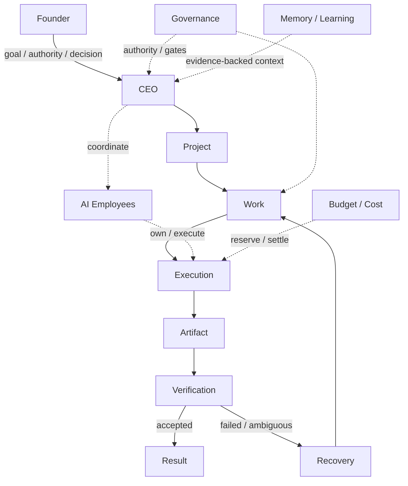

# EASON ONE Architecture

這份文件說明 EASON ONE 的 current architecture。真正的欄位、狀態轉移與限制仍以 `eason_one/models.py`、`eason_one/services/` 與 tests 為準。

## 核心原則：模型可以提出內容，但系統才持有權威狀態

EASON ONE 用「虛擬公司」組織多個 AI Agent，但不把模型輸出直接當成 durable truth。模型可以提出計畫、研究、產物或 review；Project 是否獲得授權、Work 是否可執行、預算是否足夠、Artifact 是否通過驗證、Project 是否完成，則由持久化資料與 deterministic service rules 判定。

## 角色與責任

### Founder

Founder 是最終的人類權威來源。Founder 提供目標、限制、預算與接受條件，並處理超出既有 authority boundary 的決策。Founder 不需要介入每個執行步驟；系統會把一般進度與真正需要人類決策的 gate 分開。

### CEO

CEO 是規劃與協調角色，不是無限制的 superuser。它將 Founder intent 轉成 Project 與 Work，配置組織資源、協調執行與 review，並在授權範圍內推進。相關能力分散在 `ceo_intent.py`、`ceo_operating.py`、`ceo_review.py`、`proposal_authority.py` 等 service。

### AI Employee

Employee 是持久化的組織角色，不等同於某一個 model/provider。角色、manager、instruction version、可用工具與執行歷史都可以被保存；底層模型可替換，而 Employee identity 仍然延續。

一般 Project execution 的 capacity invariant 是：

- 同一位 Employee 同時間只能服務一個 non-terminal Active Project。
- 同一 Project 可以把多個 Work 排給同一位 Employee，但實際執行會依序進行。
- 尚未輪到的 Work 會保持 queued / waiting，而不是同時假裝正在執行。
- capacity 或 capability 不足時，CEO 應走既有 team formation / HR / HiringRequest 路徑，而不是偷偷超額配置。
- terminal Project 釋放 capacity；restart 後 assignment truth 由 durable Project / Work / WorkAssignment 重建。

這個限制讓「誰現在真的在做什麼」成為系統權威，而不只是 UI 文案。

## 工作與結果模型

### Project

Project 是 Founder 目標的治理範圍。Project contract 保存目標、限制、接受條件與 authority；Project 狀態不應越過 contract 與 evidence 宣告完成。

### Work

Work 是實際可分派、可相依、可驗證的工作單位。Work graph 可以表達 management、delivery、research、review 等責任，也可以形成依序或平行的分支。Work 完成只是 Project completion 的證據之一，不等於整個 Project 已完成。

### Execution

Execution 是一次具體嘗試。它固定當次 Employee、model/provider、instruction、input context、價格與 tool boundary。外部呼叫前先檢查 authority 與 budget；回覆後保存 execution evidence、cost snapshot 與 failure stage。

### Artifact 與 Verification

Artifact 是版本化的工作產物；Verification Record 指向指定 Artifact Version。這讓「產生內容」與「判斷內容是否可接受」成為兩個不同責任，避免舊 review 被錯誤沿用到新版本。

### Result

Result 只從 Founder contract、accepted artifact、verification evidence 與必要 closure conditions 推導。Execution 成功、Work 完成或模型聲稱 done，都不能單獨取代 Project Result。

## 跨系統能力

### Governance

Governance gate 檢查 actor、authority source、決策版本、預算與 current state。寫入路徑會再次驗證，避免 stale UI 或舊 approval 繞過 current truth。

### Budget / Cost

成本不是事後報表。系統在可能產生付費副作用前 reserve，並對單次、stage、Project 與平行執行進行約束；完成或失敗後再 settle / release。

### Recovery / Restart

Recovery 使用 durable state，而不是把 Python process memory 當作真相。Checkpoint、lease、attempt number、retry lineage、provider response ID 與 external-effect receipt 用來辨識「尚未開始、已送出但回覆不明、已完成但尚未投影」等狀態。策略是 bounded retry 與 reconciliation，不是無限重跑。

### Memory / Learning

Memory 不是把聊天摘要無條件塞回 prompt。Employee learning record 可以連到 Work、Artifact Version 與 Verification Record；只有具 evidence basis 的經驗才適合成為後續工作的可信脈絡。

### Meetings / Research

Meeting 是持久化協調機制；Research 是可追蹤 execution。它們可以支援多人意見、搜尋與 synthesis，但都不能因此繞過 Founder authority、Project gate 或 Verification。

## 失敗時怎麼走

1. Execution 在 dispatch 前保存 intent、authority 與 budget reservation。
2. 成功回覆形成 durable receipt、Artifact 或 event；可確定失敗則記錄 failure stage。
3. 外部副作用狀態不明時先 reconciliation，不直接重做。
4. 可恢復錯誤在 policy 上限內建立新 attempt，保留 retry lineage。
5. 缺資料、超預算、超權限或需要人類價值判斷時，Project 進入正確的 WAITING / Founder gate，而不是製造 busywork。
6. Result 只接受與 contract 對應且通過 Verification 的 evidence。

## Founder-facing projection

Founder-facing UI 不直接暴露整個 backend state machine。

Headquarters 關注公司現在真正發生的事；Project 頁面顯示 canonical state、semantic progress、Project Team、blocker、next step、Founder action 與 budget。Technical audit 仍然存在，但屬於第二層資訊。

Semantic progress 不等於把 Work 數量硬算成百分比；它是由 current effective phase / milestone 投影而來，避免用假的精確數字製造進度感。

## Source 閱讀建議

先讀 `models.py`，再讀 `project_contract.py`、`company_kernel.py`、`work_runtime.py`、`project_outcome.py`；接著對照 `tests/test_ceo_operating_system.py`、`tests/test_v020_core_rebuild.py` 與 governance tests。檔案導覽見 [PROJECT_STRUCTURE.md](PROJECT_STRUCTURE.md)。
